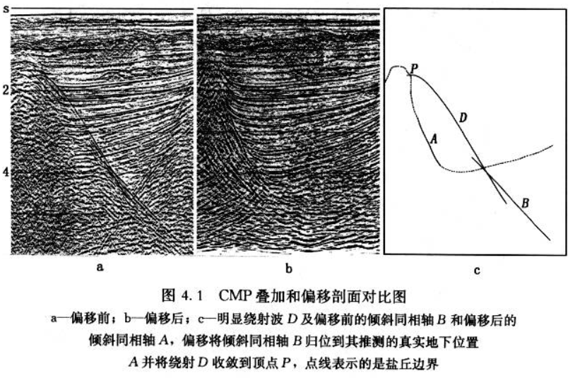
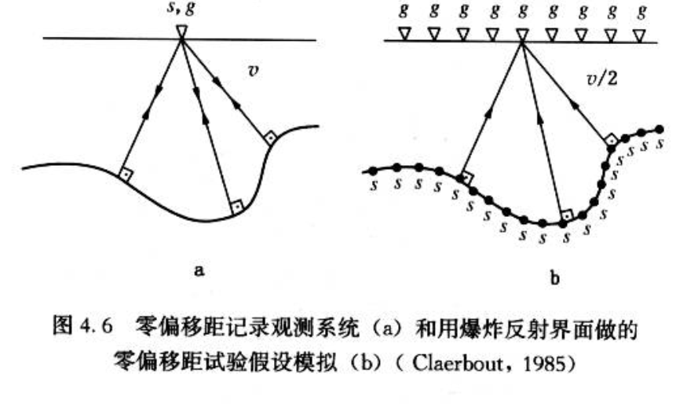
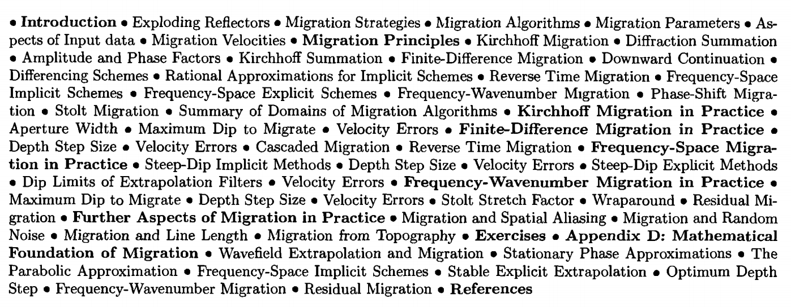

+ 偏移使倾斜反射归位到到它们真正的地下界面位置，并使绕射波收敛，以此提高空间分辨率和得到地下界面的空间图像。(p359)

+ 来自爆炸反射界面模型的地震剖面在很大程度上与零偏移距剖面是等效的，但有一个重要的差别：零偏移距剖面是一个双程时间记录（能量从震源到反射点再返回到同一位置的检波器），而爆炸反射界面模型则是单程时间记录（从震源所在的反射点到接收点）。
零偏移距剖面与爆炸反射界面模型间的等价关系不是十分的严格，特别是当测线方向上存在强烈的横向速度变化时（Kjartansson和Roca,1979)。(p363)
 
+ 如何假设才能使叠加剖面等效于零偏移距剖面呢？传统的CMP记录方式得到非零偏移距波场，在资料处理过程中，我们通过将数据叠加得到的零偏移距的中心点——时间剖面作为CMP剖面来收拢具有不同偏移距的同相轴,通常我们假设反射是符合双曲线时差规律的。
因为存在强的横向速度变化，对某些CMP道集的反射可能不满足双曲线时差规律假设，但是，它适用于其他道集反射。因此，在满足这样规律的情况下，我们可以得到一条与零偏移距剖面相似的叠加剖面。当存在强烈的多次反射和不同叠加速度的相冲突的倾角地层时，传统叠加剖面等于零偏移距剖面的假设会不同程度地受到破坏。(p365)
+ #### 偏移技术原理
  半圆形扫描叠加法，计算机问世之前；
  绕射波叠加技术，沿着绕射双曲线轨迹将地震波振幅相加的方法，双曲线轨迹形状受到介质速度的控制；
  克希霍夫积分求和技术(Schneider,1978)，但实际利用更早，它基本上与绕射叠加技术相同，不同的是在叠加前要对地震波振幅和相位进行校正。这些校正使得求和值与波动方程一致，在此过程中，考虑了球面扩散、倾角因子（振幅受角度影响）和惠更斯二次震源的固有相移；
  另一种偏移技术（Clearbout和Doherty,1972）则是基于这样一种原理，即叠加剖面可以用爆炸反射界面所得到的零偏移距波场来模拟的原理。那么利用爆炸反射界面模型，偏移原则上就可以看作是波场外推（以向下连续延拓的形式）来成像。
  继克希霍夫偏移和有限差分法偏移之后，Stolt（1978）提出用傅里叶变换实现偏移，这个方法涉及到坐标变换。保持水平波数一定，频率轴（结合输入时间轴的转换变量）变换为垂直波数轴（结合输出深度轴的转换变量）。Stolt方法基于速度是常数的假设，但是他后来改进了这种方法，使得它可以在一些速度有变化的地区进行时间偏移。
  另一种$f-k$偏移方法是相移法（Gazdag,1978）。这种方法的基本思想是在$f-k$域中用相移量来计算向下延拓，它的成像原理是在每个深度步长需要对外推波场的所有频率分量求和，在$t=0$时刻获得图像。(p368)
+ #### 偏移参数
  确定了偏移方法和适当的算法后，分析人员就需要选择偏移参数，偏移孔径宽度在克希霍夫偏移中是关键的参数，小孔径导致陡倾地层的切除，这将得到虚假的水平层，并收敛道与道之间不相关的随机噪声。
  向下延拓的深度步长在有限差分法中是关键的参数，合适的深度步长是带有最小相位误差的最大深度步长，它依赖时间和空间采样、倾角、速度和频率，它也依赖用在偏移方法中的差分算法类型。
  拉伸因子是Stolt偏移法的关键，常速介质意味着拉伸因子是1，一般来说，垂直速度梯度越大，拉伸因子就越小。(p368)
+ #### 输入数据方面
  当分析人员偏移处理地震数据时，需要关心输入数据的各个方面：
  1）测线长度或区域范围；
  2）信噪比；
  3）空间假频。
  测线长度必须足够长，从而允许一个陡倾角同相轴偏移到它的真实地下界面位置上去。在有复杂地质情况的区域，记录测线长度不够是致命的。还有，对于3D偏移，3D勘探的地表区域宽度应该总是大于地下界面目标区域宽度。
  偏移处理时，叠加剖面上较大时间处的随机噪声对浅层的资料存在潜在的破坏性，处理人员为了避免这种问题的发生不得不牺牲深部数据的偏移孔径。
  为了避免高频时陡倾角地层的空间假频出现，道间距必须足够小。尽管不准确的偏移距对于现代叠前偏移数据来说不是个问题，但是它会严重地降低叠前偏移的保真度。因此老资料和在横向测线方向的3D海上资料，常常在叠后偏移前要进行道内插。
+ #### 偏移速度
偏移中水平位移是与偏移速度的平方成比例的。因为速度是随着深度增加的，在偏移中，深部地层通常比浅部地层的误差大。同样，倾角越陡，偏移速度就越需要精确，因为位移与倾角也成比例。
偏移后的同相轴位置的精确度，实际上受所用偏移算法的特性和速度误差的共同影响。
+ #### 环绕效应
环绕效应是傅氏变换域中所作偏移算法的时间和空间里的有限数据长度的影响。在时间空间域里进行的偏移算法不会受到环绕效应影响，但在频率——空间域中的偏移算法会受到沿着时间轴的环绕效应影响。类似地，在频率波数域的偏移算法会受到沿着时间和空间轴的环绕效应的影响。(p445)
+ #### 剩余偏移
可以对倾角限制的有限差分算法的偏移结果进行改进。
剩余偏移（第二级）的输入必须是用常速偏移过（第一级）的数据。
剩余偏移的一个局限性在于往往达不到足够的偏移，这是因为第一级偏移要求的常速与数据的速度场相差很远。(p448)
+ #### 4.6 偏移中的其他实际问题
空间假频是数据采样不足的一个直接结果。因为有空间假频，所以偏移能以$ms/$道将高频的陡倾同相轴与实际倾斜同相轴区别开，其结果是偏移错误定位了倾斜同相轴的假频成分。
随机噪声通常在叠加剖面的深部更为显著，那里的速度也要大些。这种情况导致了随机噪声有规律地沿着波前弧面分布，一般看起来像笑脸。这种有规律的噪声不仅破坏了偏移剖面的深部能量，而且对偏移剖面的浅部数据也有影响。
测线长度和地表测线的位置相对于地下界面上的目标位置，对偏移剖面的可用性有着直接的影响。通常测线长度必须比地下目标界面的空间宽度要长，但要记住一点，目标区不一定直接在CMP所在位置下面形成反射的地方，目标区在偏移前的叠加剖面上。
如果地表海拔高度沿横测线变化快，那么受推覆构造影响的区域的不规则地形必须在偏移过程中考虑到。偏移算法（克希霍夫求和法和常速Stolt法除外）都是基于从一个平面深度向另一个的波场外推的。假定一个CMP叠加剖面等效于一个零偏移距波场，通常是参考了一个基准面数据。在严重起伏的地形面前，我们就需要分析高程与参考面之间的差别。否则，如果这个参考面超出地表高程，对于偏移算法而言，同相轴出现的位置比其真实的位置要深些，就会造成偏移过头。另一方面，如果这个参考面比地表高程小，则同相轴出现的位置比其实际位置要浅些，就会造成偏移不足。(p4527)
+ #### 不规则地形偏移
为了适应不规则地形，可以用以下形式的方法：
1）参考浮动基准面叠加剖面，并假设它是沿着浮动基准面记录的零偏移距波场；
2）利用波动方程从浮动基准面向水平基准面外推1）中定义的零偏移距波场，在浮动基准面的上面使用与其下面一样的速度；
3）用优选的偏移算法对2）的输出波场进行偏移。
步骤1）中所需要的叠加速度场是参考浮动基准面的，步骤3）中所要的偏移速度场需要通过分析水平基准面重新定义叠加速度而得到的。为了做好这个工作，既要用零速度手段（Beasley和Lynn,1992),也要用零波场手段（ Reshef,1991)来进行不规则地形的偏移。(p469)
+ 双平方根方程（DSR）是一个地震反射波的基本方程。这个方程描述了激发点和接收点同时向地下延拓的情况，为此可以准确处理各种倾角和偏移距的问题。忽略速度的梯度变化$dv(z)/dz$使DSR方程也可用于层状地层。利用某些外推技术，DSR方程可拓展来处理弱横向变化的地层。
$$ P(k_x,z,\omega)=P(k_x,z=0,\omega)exp(-ik_z z)$$
由地面记录波场$P(x,0,t)$，求出反射体波场$P(x,z,0)$的过程如下：
1）沿$x$和$t$方向作2D傅氏变换，获得$P(k_x,0,\omega)$；
2）然后乘以全通滤波器$exp(-ik_z z)$，获得深度$z$的波场$P(k_z,z,\omega)$;
3）对$\omega$依次叠加求和，获得$P(k_x,z,0)$;
4）最后在$k_x$方向作反傅氏变换，在此深度上求出介质图像$P(x,z,0)$。(p479)
给定地面记录的上行波场$P(x,0,t)$，我们可以把它分解成一系列单向平面波，每个平面波以与垂直方向成一定的角度传播，我们用唯一标定的数对$(k_x,\omega)$来确定这些平面波，这个平面波分解就相当于将波场进行傅氏变换得到$P(k_x,o,\omega)$。
+ 勘探地震学最前沿的内容包括三个方面，即四维地震方法、四分量地震方法和各向异性，它们都是用来对油气藏进行地震描述，最终实现监测油气藏变化的目的。
+ 某些储层利用横波资料可以更好地进行识别和检测。例如，储层上部界面波阻抗变化可能较小以至于检测不到，但是横波的波阻抗变化可能足够大，使我们能够检测到。通过记录海底的多分量数据，我们就能得到纵波和横波的成像。通常记录的四个数据分量为波场压力，纵向、横向和垂向的质点速度。因此，多分量地震记录和分析通常称为四分量地震方法。四分量地震方法主要应用于地下成像的羽状气藏、盐丘和玄武岩，描绘具有比纵波波阻抗变化大的横波波阻抗的储层界面、区分砂岩和页岩、探测从含油砂岩到含水砂岩的流体变化、探测垂直裂缝的方位、绘制烃类矿物的饱和度曲线和油水界面图件。
+ 除了野外采集参数影响之外，地震资料处理结果还依赖于处理技术。传统的处理流程主要包括三个处理环节：反褶积、CMP叠加和偏移。(p4)
+ 反褶积是通过把地震子波压缩成近似一个尖脉冲，以及在野外资料上压制交混回响来提高时间分辨率的。反褶积存在的问题是输出的精确度是不可预见的，除非它与测井资料相对比。问题的症结是反褶积的模型在特征上是非确定性的。
+ 狭义地震反演即通常提及的道反演，是指带宽时间偏移的CMP叠加资料的波阻抗估计。而广义的地震反演即通常提及的弹性参数反演，是从地震数据中直接估计弹性参数的方法。(p10)
+ 当横向速度变化不大时，时间偏移能够产生相当精确的地下成像。无论如何，深度转换必须沿着成像射线路径进行，这样可以适应由于时间偏移导致的同相轴的横向错位。(p12)
+ 深度域的地质模型通常由两套参数来描述：层速度和反射层的几何形态。(p12)
+ 深度域的地质建模通常包括从顶部开始的逐次沿层剥离反演的全过程。
1）估计第一层速度场（彩色标定层面和垂向剖面），例如使用3D一致性反演；
2）描述与底层有关的反射界面的几何形状（清晰界面），例如使用3D叠后深度偏移；
3）估算第二层速度场，并描述与底层有关的反射界面的几何形状。
+ 层速度估算的实用方法包括Dix公式转换和叠加速度的反演、一致性反演和叠前深度偏移道集的分析。(p14)
+ 实际的反射层形态的描述方法包括垂直射线法和通过时间偏移数据解释时间层位的深度成像射线转换法，通常叫垂向拉伸及平面等时间偏移。另外，反射层形态能通过解释叠前和叠后深度偏移数据资料来描述，通过适当间隔解释深度数据体垂向剖面产生反射线，再对反射层线进行空间插值产生反射层面，该面就代表包含速度域地质模型地层边界的反射从形态。(p15)
+ 一般来说，对反射波旅行时和振幅分别作反演是有益的。前者对噪声更稳健和稳定，后者对环境噪声更敏感，且易产生不稳定的解。因此，它要求更严格的限制条件。(p15)
+ 由于各种原因，地震资料通常需要应用增益函数——振幅的时变比例函数，这一函数通常根据资料来确定。在处理的早期阶段，增益的应用是为了校正球面发射，即由地震波的几何扩散引起的振幅衰减。增益通常是为了地震资料的显示而增加的。例如，应用自动增益控制(AGC)，增强了地震资料上的弱反射带。然而，自动增益控制类型的增益却能够破坏信号特征，因此必须谨慎应用。(p19)
+ 一个连续信号用过大的采样得到的离散序列实际上包含有连续信号中的高频成分，但这些高频成分折叠到离散时间序列中去时却显示出较低的频率。这个现象是由连续信号采样不足引起的，称为假频。
计算假频$f_a$应用关系式
$$f_a=|2mf_N-f_s|$$
式中，$f_N$为折叠频率；$f_s$为信号频率；$m$为整数，使$f_a<f_N$。例如，假设$f_s=65Hz$，$f_N=62.5Hz$，这相当于采样率为$8ms$，则假频为$f_a=|12 \times 62.5-65|=60Hz$。总之，采样不足有两个影响：
1）连续信号的频谱是带限的，最大频率是Niquist频率；
2）数字信号的谱被Niquist频率以外的高频所污染，它会出现在连续信号中。(p27)
+ 一个子波常常是一个短小的信号，亦即是有限延续的信号。它有起始时间和终了时间，在这两点间的能量是有限的。(p27)
+ 褶积和相关的特征：
1）褶积和相关两者的谱的带宽就是两个输入序列的公共带宽，直接的例子是带通滤波过程；
2）相位在褶积时是相加的，在相关时是相减的(Bracewell,1965)；
3）对于自相关，这意味着输出序列是零相位。
+ 反褶积是沿时间坐标方向进行处理，它从记录的地震道中消除基本的地震子波（被地层和记录系统的各种因素而改造的震源时间函数），从而提高时间分辨率，反褶积是通过压缩子波达到该目的的。
叠加也是一个压缩过程，首先通过对每一CMP道集中的各道作正常时差校正，然后将它们沿偏移距方向叠加，其结果就是叠加剖面。最后，对叠加资料作偏移，偏移使绕射波收敛，并将叠加剖面上的倾斜同相轴归位到它们地下的真实位置上。因此，偏移是一个空间反褶积过程，它能改善横向分辨率。(p80)
反褶积是假设一个固定的垂直入射是最小相位的震源子波和无噪声的白噪反射系数序列。叠加是假设符合双曲线动校正时差，而偏移则是基于零偏移距（只有一次反射波）的波场假设。没有一个假设是真实有效的。然而，当应用于野外资料时，这些技术确实提供了与真实的地下成像非常接近的结果。这是因为三步处理是非常充分的，并且这些做法对理论发展的潜在假设条件不是非常敏感。(p81)
+ 只有当反射层是水平而速度没有横向变化时CDP道集才等价于CMP道集。当地下有倾斜层时，这两种道集就不等价，只能应用CMP道集。(p85)
+ 非零偏移距多次覆盖记录除了能提高信噪比之外，还有求取地下速度信息。速度分析技术根据所选的CMP道集或道集的组合进行的，速度分析的输出之一是将速度作为零偏移距双程时的函数（速度谱）的数值表，这些数值代表沿双曲线轨迹的信号相干性的某一度量，该双曲线轨迹与速度、偏移距和旅行时有关。(p87)
+ 由于正常时差校正的结果各个道被拉伸了，并且是时变的，这使得它们的频率成分向低频端移动。频率畸变在浅层和远道最大。为了防止浅层质量降低，在叠加前要将畸变带切除。(p88)
+ 叠加速度与地下反射界面的倾角有关。当地下倾角对叠加速度影响较大时，就需要进行倾角时差校正（DMO），这样CMP已成为2D和3D地震资料常规处理流程的一个主要部分。(p92)
+ 可控震源信号是长延续度的频率调制的正弦波扫描信号，它的两端逐渐减弱。(P178)
+ 声波测井记录直接测量速度，勘探地震学家推导了许多不同的速度，如层速度、视速度、平均速度、均方根速度、瞬时速度、相速度、群速度、动校正速度、叠加速度和偏移速度。(p220)
+ 在某一给定偏移距时，双程旅行时与零偏移距双程旅行时的差叫做正常时差(NMO)。沿着偏移距轴对CMP道集进行各道求和之前，一定要进行反射波旅行时的NMO校正。正常时差校正依赖于反射层以上的速度、偏移距、与反射同相轴有关的双程零偏移距时间、反射层的倾角、炮点——检波点方向与真倾角方向的夹近地表的复杂程度和反射层以上的介质。
## Seismic Data Analysia
+ Migration

+ Migration moves dipping reflectons to their true subsurface position and collapses diffrations, thus increasing spatial resolution and yielding a _seismic image_ of the subsurface.(p462)
+ The goal of migration is to make the stacked section appear similar to the geologic cross-section in depth along a seismic traverse. (p464)
+ In practice, migration of seismic data requires decision making with regards to：
a) an appropriate migration strategy
b) a migration algorithm compatible with the strategy
c）appropriate parameters for the algorithm
d) issues concerning the input data, and
e) migration velocities.
