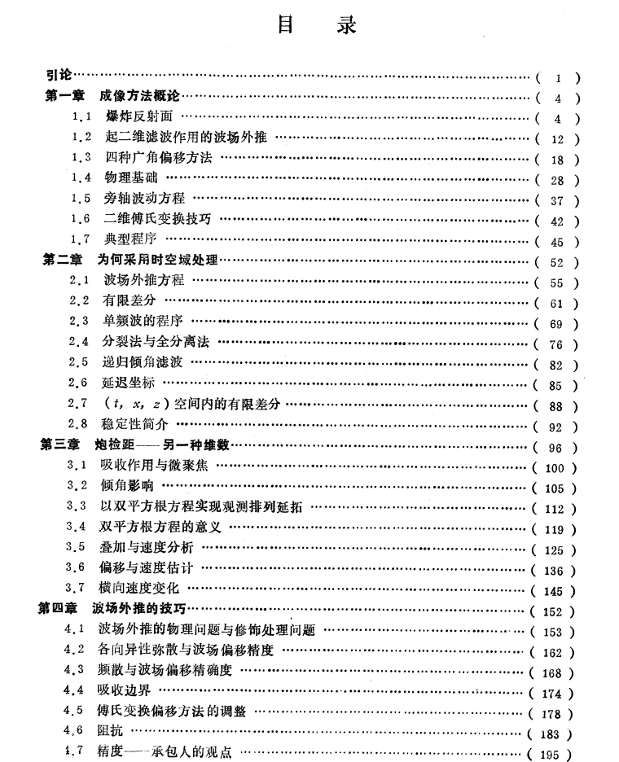
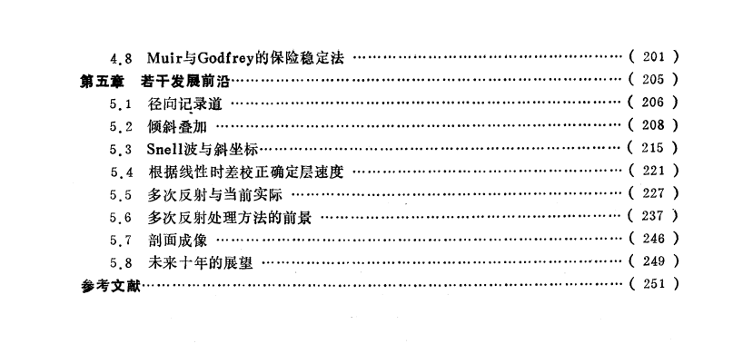
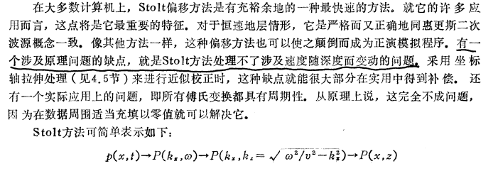
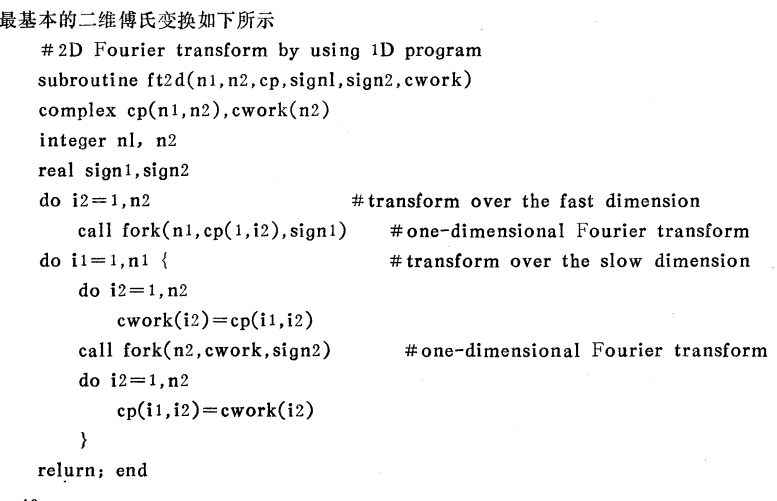
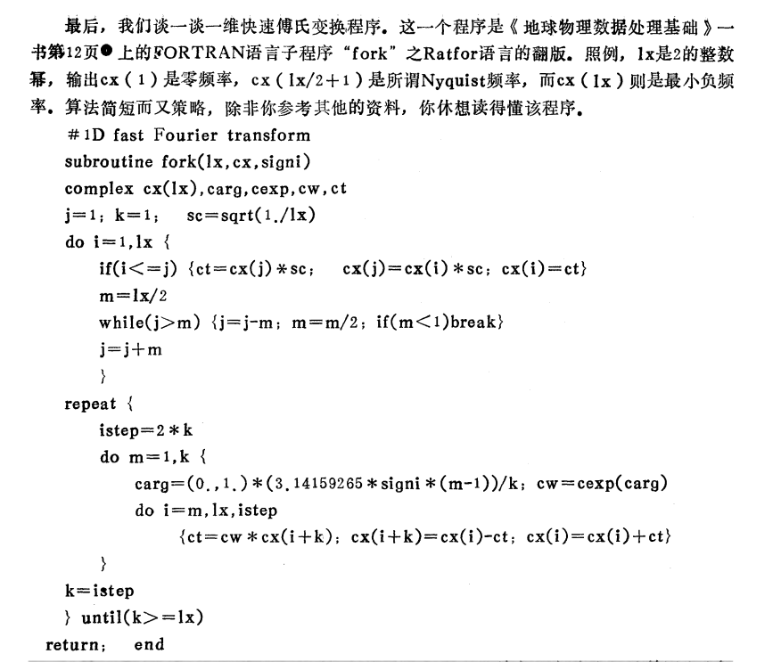
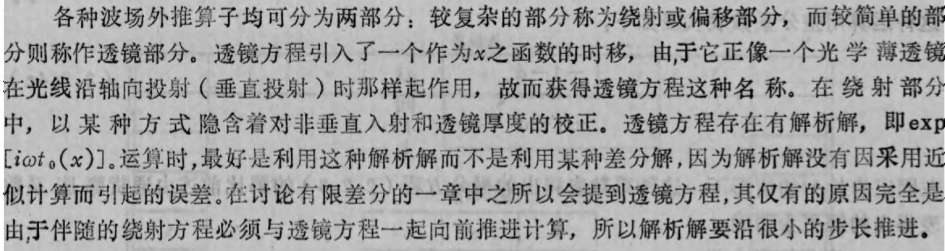
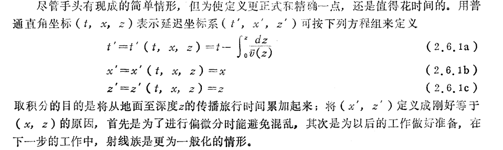

克莱鲍特. 地震成像理论及方法[M]. 石油工业出版社, 1991.

+ 船工水手们熟悉的另一种现象是：惠更斯半圆的最大振幅是位于直接指向海岸的方向上，由防波堤移动至海岸的波浪其振幅衰减至零，在光学中，这种随角度而出现的振幅减弱，称作倾斜因子(obliquity factor)。(p6)
+ 偏移的定义
1）移动
2）在$(x,t')$空间中的同相轴随深度$z$之变化而变化
3）偏移即是以某种方式将观测数据——作为$x$与$t$之函数的波浪高度——从海岸延展至防波堤的过程。这第三种定义并不过分强调移动本身，而是强调自起点至终点时的变换
4）有时把绕射看作是形成与拓展双曲面的自然过程，偏移则是完成其反过程的计算机处理
在第三章中将出现使用偏移一词的另一种情形，在该章中，水平坐标可以是炮点与检波点直接的中点$y$，或者是炮检距$h$。在$(y,h)$平面和$(h,t)$平面内全都可以将双曲面向下延拓，在$(y,t)$平面内，这种向下延拓称作偏移或成像，而在$(h,t)$平面内则称它为聚焦或速度分析。(p7)
+ 一个脉冲函数（$\delta$函数）可由许多正弦谐波（或复指数函数）的叠加构制出来，这是傅里叶分析的主要思想之一。在时间序列的研究中，就是用这种方法构制滤波器的脉冲响应。在空间函数的研究中，则用这种方法来形成一个物理点源。
把时间和空间特性合在一起，就可将傅氏分量解释为单频平面波，物理光学（以及与它有关的反射地震学）就成了滤波理论的一种推广情形。(p12)
+ 习惯上，分辨率限定为大约为有效波长的二分之一，或者大约15米。(p14)
+ 波动传播相当于一种褶积滤波，从沿反射面分布的一个区域$\Delta x_2$（或地下一个区域$\Delta x_1$）至地面上某一点这个范围内的信息，均受其影响。波动传播的逆过程，即偏移，则相当于一种反褶积处理。横向分辨率的高低归根结底要受资料的空间频宽所限制。(p15)
+ 地震波速度随深度而增大是造成分辨率受限制的原因。波越深入地传播进入地层时，由于速度不断增大，它们的空间波长就越长。垂直分辨率的情形简单来说就是这样：波长越长，分辨率就越低。(p15)
+ 将数据资料向下延拓是偏移过程的核心内容。已知在地表面$z=0$这个平面上的输入数据，必须构制出在深度$z$上可被记录到的数据。这点在傅氏变换域内很容易做到，这种方法可被看作是直接乘以某个复指数的乘法运算，即
$$P(\omega,k_x,z)=P(\omega,k_x,0)e^{ik_z(\omega,k_x)z}$$
+ 空间假频现象意味着沿空间坐标轴的数据采样不足。
在高频好和陡倾角时，假频现象变得很严重了(p20)
+ 相移法偏移成像算法：
$U(\omega,k_x)=FT[u(t,x)]$
For $\tau=\Delta \tau, 2\Delta \tau,...,$地震记录时间轴末端{
  For all $k_x${
    Image($k_x=0$)
    For all $\omega${
    $C=exp(\sqrt{1-v^2k_x^2/\omega^2})$
    $U(\omega,k_x)=U(\omega,k_x)*C$
    $Image(k_x,\tau)=I(k_x,\tau)+U(\omega,k_x)$
    }
  }
  $image(x,\tau)=FT[I(k_x,\tau)]$
}
模拟上行波$u$的程序为：
$Image(k_x,z)=FT[image(x,z)]$
For all $\omega$ and all $k_x$
$U(\omega,k_x)=0$
For all $\omega${
For all $k_x${
For $z=z_{max},z_{max}-\Delta z,z_{max}-2\Delta z,......,0${
$C=exp(+i\Delta z \omega \sqrt{v^{-2}-k_x^2/\omega^2})$
$U(\omega,k_x)=U(\omega,k_x)*C+Image(k_x,z)$
}
}
}
$u(t,x)=FT[U(\omega,k_x)]$
(p22)
+ Stolt方法

+ 大多数储油岩石都是砂岩，砂岩往往是由水速不足以起搬运作用时在河口附近沉积的沙所形成。
+ 石油勘探人员采用标准的野外观测系统按常规方法观测由P波至S波的转换的企图失败了；而理论却预言以某种角度入射在分界面上的P波应局部转换成SV波。再者，在通常所遇到的以30至60度角度入射的反射波这种这种情形下，这些转换波应具有可与P波相比拟的强弱范围。
常规的观测排列和处理在某种程度上是要削弱转换横波的，但是它也削弱多次反射。(p30)
+ 在偏移处理之后最可能得到的横向分辨率大约为20米至50米。(p31)
+ 我们通常不是把$(x,z)$空间放在计算机内存中并令时间$t$演化发展，而是把$(x,t)$空间放在内存中并沿深度$z$方向进行外推，根据地面上的信息（数据资料）试图外推出一定深度上的信息。(p31)
+ 速度$v$是通过非常窄的频率范围观测到的。速度观测涉及要对旅行时间随炮检距而变化的情形进行研究。
对反射地震学家来说，速度的意思就是指“真速度”的低空间频率部分，“真速度”的高频部分从未称作速度，而是称作反射率(reflectivity)。(p32)
+ 傅里叶变换
 
 
+ 频率域内消除干扰要求过苛
傅里叶方法是整体性方法，就是说，在可以开始进行处理之前，必须掌握有全部数据组，间接误差与截断误差可能具有严重的加班影响。另一方面，有限差分方法则是局部性方法，各数据仅与其邻点直接有关，间接误差传播缓慢。(p54)
+ 抛物型方程
垂直下行平面波在数学上以下述方程表示
$$P(t,x,z)=P_0e^{-i\omega(t-z/v)}$$
式中，$P_0$纯为常数。将$P_0$用某种不是严格恒定而是缓慢变化的函数$Q(x,z)$来代替，即可模拟偏离垂直入射的微小角度变化，即
$$P(t,x,z)=Q(x,z)e^{-i\omega(t-z/v)}$$
将之代入标量波动方程$P_{xx}+P_{zz}=P_{tt}/v^2$，得
$$\frac{\partial^2Q}{\partial x^2}+(\frac{i\omega}{v}+\frac{\partial}{\partial z})^2Q=-\frac{\omega^2}{v^2}Q$$
即
$$\frac{\partial^2Q}{\partial x^2}+\frac{2i\omega}{v} \frac{\partial Q}{\partial z}+\frac{\partial^2 Q}{\partial z^2}=0$$
为使波场接近平面波，$Q(x,z)$必须接近于一常数。适宜的假设应是$Q$沿深度的最高阶导数，即$Q_{zz}$可忽略不计，这就使我们得出抛物线型波动方程
$$\frac{\partial Q}{\partial z}=-\frac{v}{2i\omega}\frac{\partial^2Q}{\partial x^2}$$
+ 透镜方程
(p61)
+ 要考察运动之中的波，比较好的方法是沿着这些波一起移动。所以，为描述正在向下移动进入地层中去的波，我们放弃$(x,z)$坐标而采用运动坐标$(x,z')$，其中$z'=z+tv$。
替代运动坐标系统的一种办法是定义延迟坐标$(x,z,t')$，其中$t'=t-z/v$。延迟坐标的经典例子就是太阳时，飞机以太阳的速度向西飞行，则在飞机看来，时间似乎是静止不动的。
延迟坐标比运动坐标更通用的原因：在固体地球物理学中，速度可能既与$x$有关又与$z$有关，可是我们进行地震观测期间，地层却不随时间$t$而变；而在一个运动坐标系统内，速度却可以与所有三个变量都有关，以致不必要地增加了计算的复杂性。Fourier变换是求解波动方程的一种通用工具，可是当系数不是常数时，它就没多大用武之地了。(p85)
+ 定义延迟坐标系

+ 炮点与检波器之间水平间距往往多达3公里，这三公里炮检距已可与许多石油储集层的深度相比了。(p96)
+ 处理中，将共中心点道集(CMP)的所有记录道进行时差校正，使时距曲线拉平成直线，然后彼此想加，所得结果酷似一个零炮检距记录道。所有这些记录道集合起来，就叫做共深度点叠加剖面。实际上，总是把CDP叠加剖面当作是一个零炮检距剖面来加以解释和进行偏移。(p104)
+ 进行共深度点叠加可使具有叠加速度的同相轴得到加强，压制具有其他速度的同相轴。(p111)
+ 一个观测排列是指：点震源或炮点置于$x$轴上的$s$处，然后用$x$轴上各个可能位置$g$上分布的检波器对反射进行记录。所以，观测到的资料是一种上行波，它是与$s$和$g$有关的二维函数$P(s,g,t)$
位于$(x,z)$的反射面之映像是按最靠近的可能的成对炮点与检波点上所见到的反射强度与极性来定义的，取其数学极限时，这种最靠近的成对点相当于震源与检波点在反射面上彼此重合了，这时的反射旅行时间等于零。这种观测排列延拓成像概念可总结为下列关系
映像$(x,z)$=波$(s=x,g=x,z,t=0)$
对于良好质量的质量，就是说，碎玉符合向下延拓方法假设的资料，应可将反射能量偏移至零值旅行时间时的零炮检距情形。对反射能量没有达到这种状态的原因仔细进行研究，将能使该模型得到进一步改善，要改善模型通常就相当于要改善速度的空间方便情形。(p115)
+ 将数据遍及所有炮点$s$进行求和（无需时移而求和）。这样一种求和相当于是模拟下行平面波，该求和过程幕后所隐含的成像原理是要找出在下行波到达时间上出现是上行波。(p124)
+ 为消除冗余信息而进行叠加这种论点大概更适合于作为一个统计问题来处理，而不能作为一种物理问题来处理。(p125)
+ 比起波动方程来，用射线法来解决排列末端数据丢失和排列长度范围内出现空间假频的问题，大概要更为灵活。(p125)
+ 正常时差校正(NMO)就是对时间轴进行某种拉伸，使所有地震记录看起来像是零炮检距地震记录。
能够作正常时差校正的是共炮点道集或共中心点道集。应用于共炮点道集的正常时差校正使该道集成为类似于零炮检距时间剖面的一小部分，这时地质构造突出地被展现出来。对共中心点道集进行正常时差校正，是确定地层的速度与深度之函数关系的主要手段，这时因为共中心点道集对地层之倾角是不灵敏的。
从数学上说，有关正常时差NMO的变换是一种线性运算。线性性质仅要求：对于将原始数据分成几部分的任何分解来说，经过正常时差校正的几部分之和应等于和之正常时差校正。分解的例子包括：1）分成较早时间和较晚各时间；2）分成偶数时间点和奇数时间点；3）分成高频和低频；4）分成大信号值与小信号值。
为把正常时差校正想象成是一种线性算子，试将地震记录考虑为某种向量。NMO段子类似于一个对角矩阵，但是沿矩阵对角线分布的是内插滤波因子，而且各内插滤波因子均有偏离对角线的相移以形成所期望的时移。(p125)
+ 常规速度分析要利用一系列试验速度，某种试验速度取为深度的恒定函数并用它对数据进行时差校正。
定义切除函数是常规处理中的重要一部分。切除函数就是用于压制掉数据中某些不希望要的部分时所使用的一种加权函数。加权与切除对叠加的质量有重大影响。(p127)
+ 因为记录道数目不充分而产生了一些涉及到共中心点道集的实际处理问题。截断问题便是因检波器电缆只有一定长度而非长达遍及地震波传播之距离而发生的问题。还有，假频问题便是因炮点与检波点彼此便是足够靠近而产生的实际问题。沿炮检距坐标轴出现空间假频，它对波动方程方法是影响看来比对射线追踪方法的影响是个更为严重的问题，原因在于正常时差校正降低了空间频率。因与检波器、电缆及地面耦合条件等实际问题有关而形成的数据缺失空白，也常常会造成意外的困难。(p130)
+ 做正常时差校正，就是说，把双曲线时距曲线拉伸展平。首先遇到的问题是，必须用什么速度做正常时差校正才行。为易于进行记录道内插，合适的时差校正速度应该属于道集上能量占优势的那种速度。(p131)
+ 通过地层内一个垂直断层时，速度变化将是水平坐标的一个简单阶跃函数。因为反射系数和透射系数与角度有关，传播这样一种断层的射线会经受振幅变化。由于有共同的近于垂直的射线，只要存在很小的速度差异就能产生很强的内部反射。根据这个道理，陡断层应当是畸变得更多，从而断层在小炮检距剖面上就比大炮检距剖面或叠加更容易辨别出来。(p149)
+ 爆炸反射面模型无法产生零炮检距剖面上能见到的所有射线。爆炸反射╮(╯_╰)╭模型产生两种类型射线：直接抵达地面的射线和达到地面以前由断层面反射的射线。零炮检距剖面则有三类射线：两种射线路径与前述相同，但有双倍旅行时间，一次是上行，一次是下行；另外就是在一个路程中遇到断层面而在另一个路程中则遇不到断层面。(p150)
+ 使速度函数有不必要的突变，就可能形成虚假的断层面反射。假想的偏移速度应当沿横向方向尽可能地平滑变化；在数据处理中心，绝不应使不不处于决策地位的拙劣而又未经训练的工作人员享有随便采用快速横向变化速度模型的自由。(p150)
+ 
