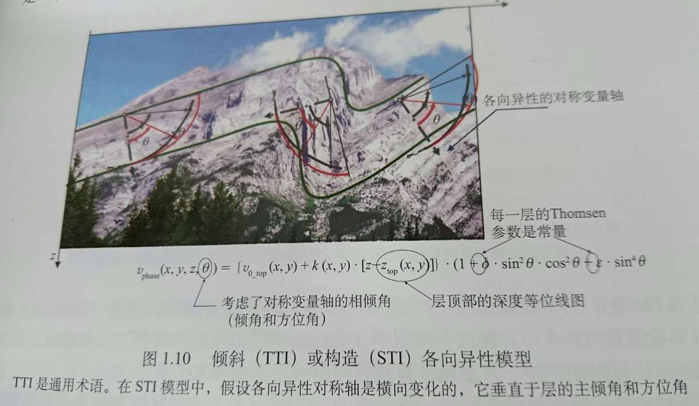
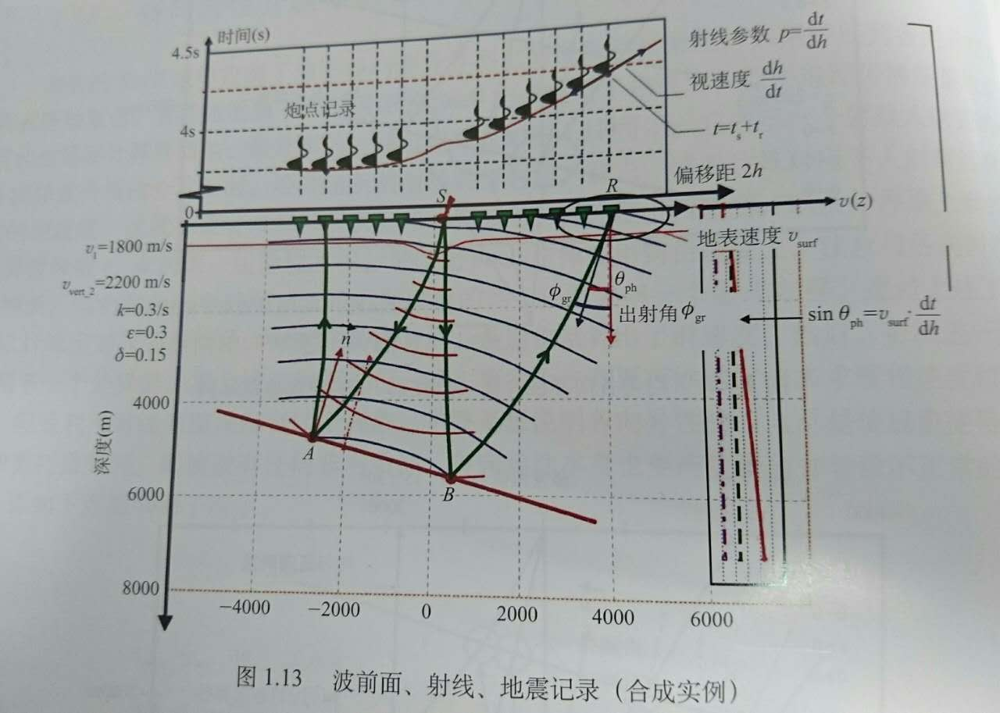
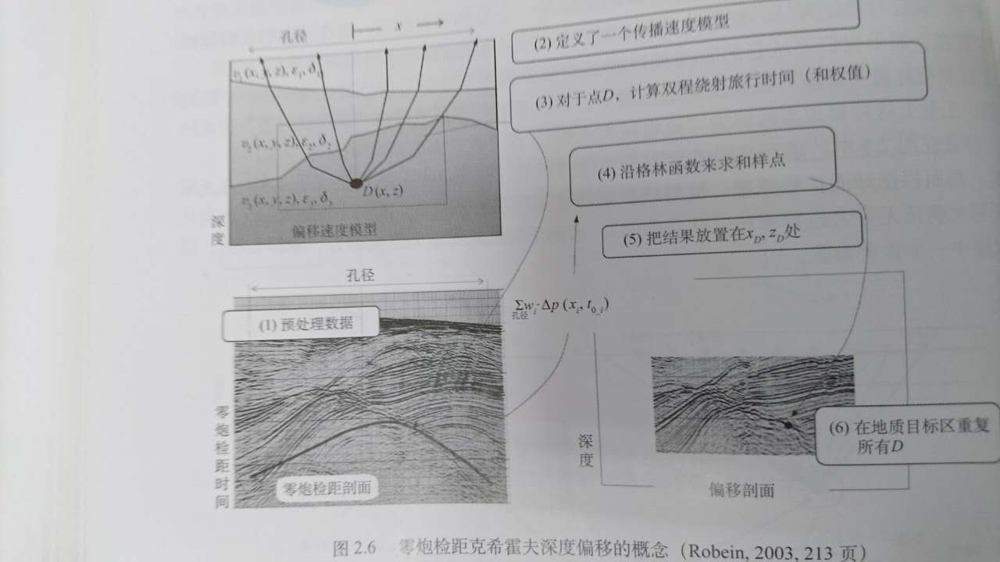
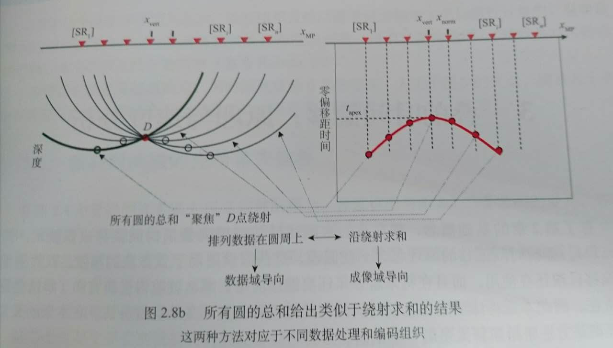
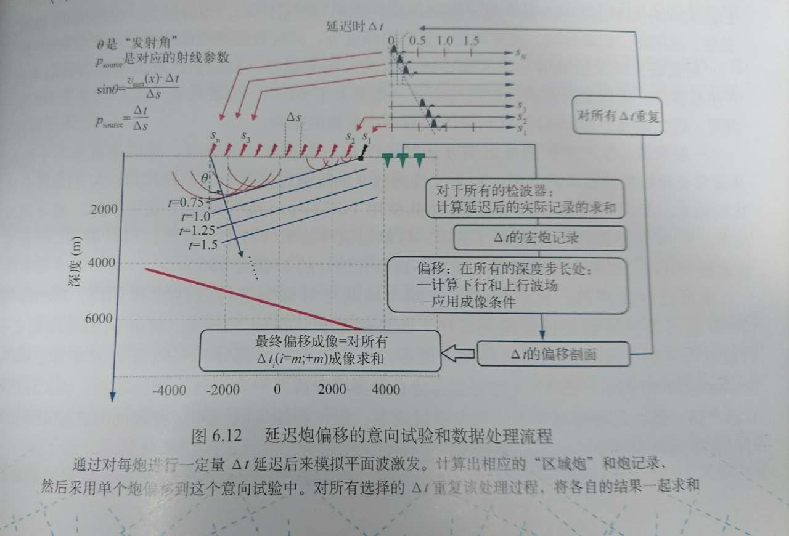
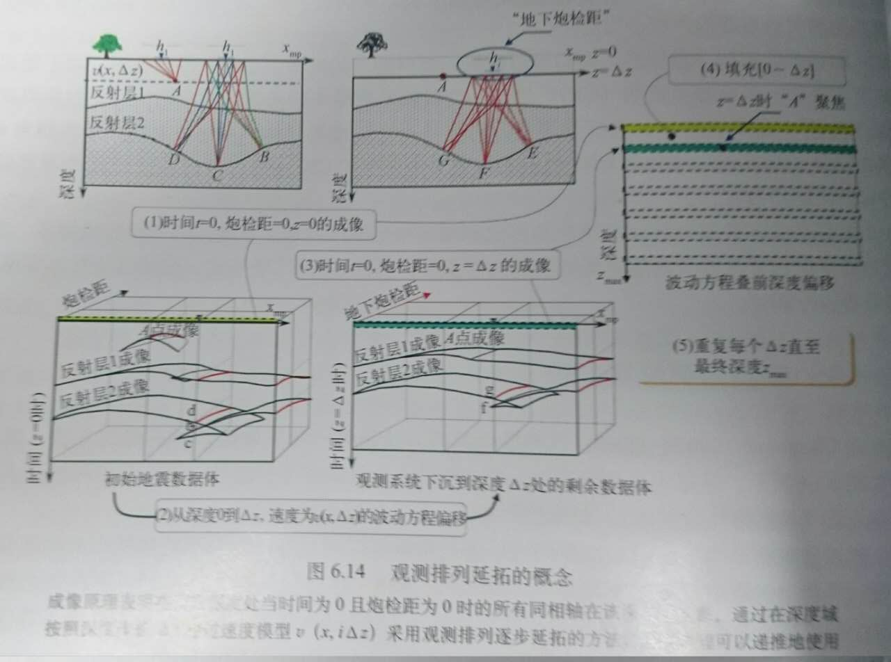
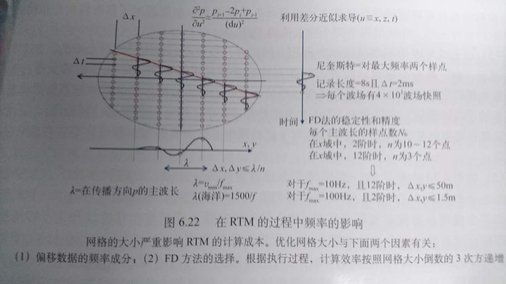

 ## 地震资料叠前偏移成像：方法原理和优缺点分析
 （英文版2010，中文版2012）
 + 在具有一定处理周期的复杂数据处理流程中，地震成像是最后一个环节，它的目的是为地球科学家提供适合于解释的地球内部清晰图像。(p1)
 + 目前在油气工业界中最常用的叠前成像方法主要包括两类技术：时间域成像、深度域成像。时间域成像和速度分析尽管几乎自然地结合在一起，但还是以牺牲成像质量为代价，只有深度域成像才要求速度模型的准确构建。地震采集技术、成像技术、高性能计算机的最新进展使我们能够正确地认识更为复杂的地质模型，因此也就可以对以前看不见的复杂构造进行成像。(p1)
 + 这些“地质非均匀体”通常在地下具有一定的横向连续性，这在地震术语中称之为“层”，或更常称为“层分界面”或“反射界面”，按照物理地震学的观点，也叫"绕射点"。(p1)
 + 更准确地说，折射出现在速度发生变化的地方，反射发生在“声波阻抗”出现变化的地方。声波阻抗是任何介质的一个弹性特性，它是传播速度和密度的乘积。成像的关键点是反射波振幅正比与入射波振幅，这个比例系数称为反射系数。在各向同性情况下，它是非均匀体（通常是一个地质层）上下两层的三个弹性系数与绕射角的函数。“成像条件”就是用于计算反射系数的。因此，我们把地下每个点“弹性反射率”的图像称为地震成像剖面。(p2)
 + 发送到地下的弹性信号是有频带宽度限制的，即它并不包括所有的频率并且它具有一定时间长度。想象有两个（垂向）相邻很近的地层，其对应的反射波以远短于子波长度的时间间隔先后到达地表：这两个“反射波”就混合在一起，在地震剖面上就分不出两个清晰的地层了，也就是说地震信号是频带限制了地震剖面的分辨率。注意，地震信号的频带限制主要来自两个方面：一方面是向地下发送极低频信号的内在物理限制，另一方面是当波向地下传播时，波的高频成分会“自然”衰减。(p3)
 + 反射系数是声波阻抗对数的导数。(p3)(?)
 + 地层弹性参数的非均匀性不仅可以从下行波观察到，也会反映在传播返回地表的上行反射波上。因此反射、折射、透射现象同样会发生在上行反射波传播过程中，这意味着上行反射波的部分能量会以更低的振幅向下传播，它们被称为“多次反射波”或“多次散射波”。由于它们并不遵守成像中所用的传播规则，因此我们认为它们是不需要的波。这种波在地震剖面上以误导作用而存在，在经典成像技术中，处理多次波的通常方式是在处理阶段努力从地震记录中消除它们。然而，多次反射波还带有地下反射系数场的信息，因此在成像中一个新的重要课题是：如何直接利用它而不是预先消除它？(p4)
 + 在勘探阶段，地震成像主要用于构造解释、岩石体积估算或井位优化部署。
 在油田开发阶段，更需要利用地震信息去进行油藏描述：包括油气藏边界检测、精细构造解释、精确的断层定位、储量计算修改、井轨迹优化部署，甚至通过地震属性确定油藏特征（AVA、声波或弹性波阻抗刻画孔隙变化等)，这是地震油藏描述的内容。(p5)
 + 假如震源子波是一个非常短的尖脉冲，即震源子波具有无限宽的频带，波前实际上代表全波场。我们有时用术语“波传播的高频渐进线”来说明波前和射线理论。
 + 在复杂介质中，伴随着各种可能出现的“焦散曲线”（多值波前和交叉射线，也称为“多路径”），波前和射线会变得很复杂。同样需要注意的是，波前和射线是在平滑后的模型中计算的：这是因为在剧烈变化和大入射角情况下，这种射线的计算是非常不准确的。(p13)
 + 波传播的速度值与传播方向有关，称这种物理现象为“各向异性”。(p14)
 + 为了可用于计算机处理，下一步就是要对各向异性参数化。面前最常用的方法就是使用一组Thomsen参数（Thomsen,1986）。
 当P波在地下传播时，可以用四个参数来描述指定位置$(x,y,z)$的各向异性：
 1）平面波垂直传播的相速度$v_{phase-vert}(x,y,z)$;
 2）两个Tomsen参数$\varepsilon$、$\delta$；
 3）对称轴的方向（对VTI来说对称轴是垂直的）。
 
 + 射线、波前和地震记录关系
 
 1）首先，要注意入射和反射群倾角，正因为层的各向异性，它们才是不同的。
 2）在反射点位置，根据作图，下行波和上行波是一致的。它们在反射面上用A和B来表示。
 3）如图中蓝箭头标注，可以求出炮记录上反射波的时间倾角。时间倾角$dt/dh$也叫“射线参数”，用$p$表示，其倒数$dh/dt$称为“视速度”。
 4）用简单的几何学知识通过图中给出的方程，可以把从炮记录测量出来的视速度与地面上测量的出射线的相倾角通过图中给出的方程联系起来。
 5）这意味着如果我们知道地表的速度，我们就可以从炮记录同相轴的视速度中推导出对应反射射线的出射角或波前。(p20)
 + 地震波长介于十米到几百米之间。(p21)
 + 在资料处理中，通过“DMO叠加”而产生零炮检距剖面是在现在叠前成像方法常规化之前的关键处理步。(p22)(?如何理解？)
 + 在基于克希霍夫求和的成像技术中，实际上我们假设地下的每个点都是一个绕射点，那么“成像”就是分别“聚焦”这些不同绕射点中的每一个点，“克希霍夫偏移剖面”就是把这些聚焦后的每个绕射点并置在一起。
 
 从图左下角的预处理后数据开始，也就是零炮检距剖面。做好偏移的前提是得到好的地下速度场。
 接下来研究深度域上的特定点$D$。在选择的孔径范围内，我们从$D$点发射“动态”射线经过速度模型后到达地表，动态射线追踪意味着我们不仅计算旅行路径和对应的旅行时（射线的运动学特征），而且要计算波在地下传播时与波的振幅演化的参数，特别是包括球面扩散。波的振幅与旅行时一起形成了波从点$D$经过速度模型$v$到达地表点$x$的"格林函数"，注意$v$可能是任何非均匀各向异性三维模型。
 下一步由以以下几部分组成:1）在选定的孔径范围内，在数据域（零偏移距剖面）提取分布在已算出绕射双曲线的样点；2）用格林函数（和其他信息）来计算权值；3）最终计算$D$点的估算反射系数。这个值放在偏移剖面上偏移后$D$点的水平坐标$x$处和深度坐标$z$处。这个过程在地质目标区的所有$D$点上不断重复，最终的偏移剖面就是把所有点$D$各自成像并置在一起。
 在这个最终偏移剖面上，由于沿着反射面存在有效的非零反射系数，反射面就自动很简单地出现了。
 注意克希霍夫求和成像有个非常有趣的优点：成像可以在一定的区域或选定的剖面上进行，这样在计算速度模型的多次迭代中就可以节省大量的时间，但是速度模型需要从地表开始定义到全空间。
 克希霍夫求和中的权值不仅依赖格林函数，而且很大程度上依赖于采集的观测系统，为了保证反射系数的可靠求取，在这方面有大量的工作要做。(p26)
 + 高斯射线束偏移方法------ 反射面面元
   克希霍夫求和偏移------孤立的绕射点
 + 成像域与数据域偏移的实施
 有两种方式可以重构一个给定的绕射点：1）在数据域沿双曲线求和样点；2）沿圆排列每个样点振幅，然后在成像域求和所有的圆。
 
 + 克希霍夫求和的思想：通过沿着绕射曲线轨迹（三维是绕射面）对样点进行加权求和得到该绕射点是反射系数。(p31)
 + 对于三维的情况，地震道中心点、偏移距和方位角是变化很大的，共偏移距实际上是共偏移距范围，它包含了属于在“标准偏移距”附近的一定偏移距范围内的所有地震道，其目的是形成均匀、规则、密集分布地震道的共偏移距体，这是非常重要的，因为缺失偏移距道或强能量异常振幅尖脉冲容易引起偏移噪声（画弧）。(p34)
 + 对于一给定的速度函数，CIG（共成像点道集）代表了从不同偏移距组所得到的成像信息。需要注意的是这等效雨二维数据就增加了第三维，对于三维数据体就增加到第四维，如果考虑到炮检点的方位角时甚至增加到第五维。
 对于地下介质是唯一的，如果一切都是准确的，对于给定的一反射层，不论使用哪一偏移距，其表现出的都是真实（相同）的旅行时间。这就是我们所期望的“成像道集拉平” 。(p36)
 叠加可以增加信噪比，在某种程度上也可以达到增强一次波、压制多次波的目的。
 叠加处理取得较好的效果，关键点是道集拉平。但是在实际应用中有三个因素使其达不到这个要求：
 1）违背了在孔径加减半个炮检距的范围内横向速度不变的假设。由于孔径可达到几公里的长度，因此这个假设很少能够满足。
 2）速度函数不准确。
 3）计算绕射曲线的方法不够精确，尤其对于存在严重垂向非均匀性、陡倾角或各向异性是大孔径和大偏移距的情况。(p36)
 + 绕射曲线就是属于一个成像点的“偏移算子”，也是为了偏移归位和计算出成像道集我们应用到每个合适数据样点的“偏移算子”。(p37)
 + 实际上速度分析的结果是“将道集最大限度拉平”的一个参数。(p40)
 +  克希霍夫叠前深度偏移的注意到：
 1）复杂模型中的射线和波前面是非常复杂的。波前面的计算是一种替代射线追踪的经典方法；
 2）在复杂模型中，旅行时是多值的。由于存在多值现象，射线会在地下某些点交叉，这种点被称为焦散点；
 3）平滑是必要的，但对深度偏移结果存在一定的影响，因为平滑在一定程度上改变了偏移的时深转换关系。为了减少这种影响，首先平滑要在慢度域进行，其次，尽管射线路径是在经过平滑的速度模型中计算得到的，但沿着这些射线路径的旅行时要在未经过平滑的速度模型中计算求取，平滑程度以及平滑方法都有一些重要参数控制着最终的结果。(p58)
 + 克希霍夫偏移中，存在焦散点的后果就是绕射曲面存在多值现象。克希霍夫积分求和算法对绕射曲面的多值现象还没有更好的解决办法。在商业软件中对于这个问题存在三种解决方案：
 1）只用最短的时间，能很好地适应基于程函方程积分的旅行时计算，程函方程就是只考虑旅行时间（波的运动学特征）的波动方程一种小时；
 2）使用最短的传播距离。这种处理方式避免了产生复杂的传播路径，尤其在反射能量可能较弱的盐丘构造中；
 3）选择和使用能量最高的射线路径。(p59)
 + 绕射成像
 1）相较于反射波而言，绕射振幅能量是比较弱的；问题是我们是否应该将这两个信息分离出来，如何分离。
 2）某一绕射点能量可能出现在多个不同的CIG道集上，并呈现出倾斜同相轴的特征，只有恰好位于该点正上方的CIG道集上的同相轴才是平的。
 绕射成像在克希霍夫积分处理过程中能够通过“加权”来加强与绕射相关的能量，减弱噪声能量或弱化非“镜像信息”。
 有人只对绕射能量和相应绕射成像感兴趣，这些数据携带着丰富的信息，并且可以对某些感兴趣的地质特征提高成像质量，如断层、异常体、岩溶洞、裂缝的分布及走向等等，这给地震成像打开了一个新的领域。(p83)
 + 所有射线束偏移技术都首先把地震数据变换到$\tau$-p域（p84）[$\tau-p$变换](http://wenku.baidu.com/link?url=7ZD7OZl1MByuQsoh5klvZvGAEDM_ARWcw4y6HJv_aNh1B4hjke0V2dkQpgBXz4ykJ74VAsHjxkcEq85dRilUyXEp53vrB0dG6X788Jiqsd_)
 + 零炮检距数据射线偏移：出发点是地震数据上测量的“视速度”（或等效的“时间倾角”或“射线参数_p_”）、地面速度以及到达地面时射线出射角三者之间的关系。（p84）
 + （非零炮检距定位反射层）
      在炮域，从炮点位置试验几个激发方向$p_s$；
      将数据分选到共检波点域并在检波点位置$p_r$顶部的激发位置上测量射线参数$p_s$；
      在共炮检距域上测量中心点射线参数$p_{mp}$并试验满足$p_{mp}$的不同炮点和检波点对($p_{s}$,$p_{r}$)；
      在共中心点域上测量炮检距射线参数$p_{h}$并试验满足$p_{h}$的不同炮点和检波点对($p_{s}$,$p_{r}$)。
+ （基于波场延拓的）成像原理：下行波的到达和上行波的反射在时间和空间上同时发生处就是一个反射成像点。甚至可以说上行波和下行波的振幅比就是该点的反射系数。
基于波场延拓成像的实现步骤：
    1）从炮点是_s(t)_开始模仿下行波场$p_d(x,z,t)$：
    2）从地面仪器接收到的炮记录$p_{up}(x,z=0,t)$开始按时间倒序重构地下每处的上行波场$p_{up}(x,z,t)$；
    3）应用成像原理，即寻找上行波和下行波在什么地方和什么时候是“时间一致性”的。（p110)
注意在计算机里，波场是零散函数，数字网格的时间和空间采样$\Delta t, \Delta x,\Delta y$和$\Delta z$影响着波场模拟的精度。这些参数是成像时非常重要的参数，尽管有些参数在野外采集时已经被固定，如野外采集时的道距$\Delta t$（通常数值范围是12.5~50 m）以及采样率$\Delta t$（一般2 ms）。只要在满足基本采样定理的前提下，运算时处理人员可以灵活地选择不同的$\Delta t, \Delta x,\Delta y$和$\Delta z$。
+ 炮点偏移的工作流程：在每个深度$0,\Delta z,2\Delta z$等处，我们计算出穿过速度层$v(x,i\Delta z)$的上行和下行波场。这两个波场进行道与道的互相关，并且把结果放到对应的深度上，从而以这种形式得到偏移后的单炮(p116)
+ 偏移孔径是需要处理炮的炮点到该炮的最后一个有效检波点或最后一个炮检中点之间的固定距离。注意，太小的偏移孔径可能会导致复杂构造体的深反射界面不成像，而太大的孔径会带来高计算成本。与基于射线偏移方法一样，炮偏移孔径在三维中是一个面，该参数在偏移项目开始时需要进行试验确定。(p117)
+ 炮偏移噪声通常称作“偏移画弧”，一般出现在反射界面可照明部分的边界区，这是炮偏移本身的固有现象。如果地下的反射面刚好限制在照明段内，那么其边界将会产生绕射，在野外采集时，这些绕射应该能记录下来，因此，在反射界面的边界处，偏移就可以将反射端点的绕射波聚焦收敛。然而，由于反射界面相对较大，数据中的绕射并不存在，所以偏移结果将相反地产生“偏移画弧”。
当相邻炮足够近时，当我们叠加几个相邻炮的偏移结果时，偏移的边界效应在求和中部分得到削弱，否则，偏移噪声相当强。这种情况，就必须在采集设计时加以考虑，也可以通过“炮域共成像点道集”的“切除”来进一步地减弱边界画弧现象。(p117)
+ 实际上在叠加前我们能够从每个偏移炮中收集具有同一位置的道，“CIG”，该道称为“炮域共成像点道集”（也有术语叫炮索引共成像点道集），它主要有两个用途:
1）进行质量控制；
2）进行再次数据处理，特别是进行恰当的切除以进一步降低边界效应的影响及压制其他噪声。(p118)
+ 波场延拓方法比较昂贵，因而发展了很多有关提高处理效率、降低偏移耗费时间和成本的技术。多炮组合进行同步偏移就是其中的方法之一，多炮组合原理并不是新的，Berkhout(1992)和Riefeld(1995)提出了“区域炮技术”：与单炮点震源不同，人们做了一个“理想的实验”，即排列在给定区域的多个震源激发，每炮与其他的炮之间存在延迟。这个区域震源产生一个下行波场，该波场是由每个单炮分别产生的波场组合而成，同样，反射的上行波场和记录波场也是分别由每个记录的波场类似的组合而成。
基于地震实验的线性属性，这个概念在炮点偏移中应用有两种方式：一方面是应用“平面波或延时炮”(Whitmore,1995;Duquet,2001)，另一方面是采用“编码炮”或“调谐炮”。(p123)

+ 由Clearbout(1985)提出的观测排列延拓方法是另一种整体偏移所有炮的方法。从基本观测面开始，在$t=0$处上行波场和下行波场一致，炮点和检波点自身也一致（类似爆炸反射面），即炮检距为0，并且每炮如此。

观测排列延拓技术在目前仅有的工业化应用是假设地震道都具有相同的方位角，这就是该方法被称作“共方位角偏移”的原因。还有一个假设由Biondi于2006年提出的，即在每个偏移步上，向离开炮点信息的向下传播发生在同一个平面上。（p127）
+ RTM原理：如果能够重构出地下给定点$(x,y,z)$处的上行波场和下行波场的全部“历史”，由成像条件可知该点的反射系数就是这两个“历史”数据互相关后经过比例的值。
有了“波场快照”和成像条件，就可以理论上确定RTM的工作流程，具体步骤如下：
1）从震源信号开始，在连续时间步长dt、2dt、3dt等处模拟处下行波场的快照，并存储这些波场快照。
2）该过程是递推的，即时间$t+dt$处的波场快照是根据已知的整体速度场$v(x,z)$（可能是各向异性的）由时间$t$处的波场快照计算出来的，典型的$dt$值一般是1ms或2ms。例如，对于一个6s时间的记录，就必须计算出6000或3000个波场快照数据并可能存储一半的该数据（至少要满足精确的相关要求）。每个快照数据大小理论上与最终偏移成像的大小一致。
3）完成下行波场计算后，就开始第二个递推计算，这次是按逆时间进行的，是进行上行波场反向延拓快照的计算。
4）通过应用成像原理，在第二次递推的每个时间步，上行波场的每个采样点$(x,z)$与其对应的下行波场的每个对应样点相乘并求和，将结果放置到对应的偏移成像位置$(x,z)$处。偏移成像结果就这样被连续建立起来，在成像条件中每个时间步长都对互相关结果有其自己的贡献。(p129)
+ （RTM）为了尽可能地节省项目的成本，人们已开发很多“技巧”或处理方法：
1）优化网格大小；
2）孔径的选取；
3）在模型的边界处预先计算下行波场;
4）并行化编码、域分解；
5）同时也有编码炮技术。
网格大小直接影响求解波动方程的数学运算量，相较于数据体的范围和大小而言，网格大小更影响内存管理难度。网格优化受采样定理及数值运算方法精度和稳定性的制约。

+
