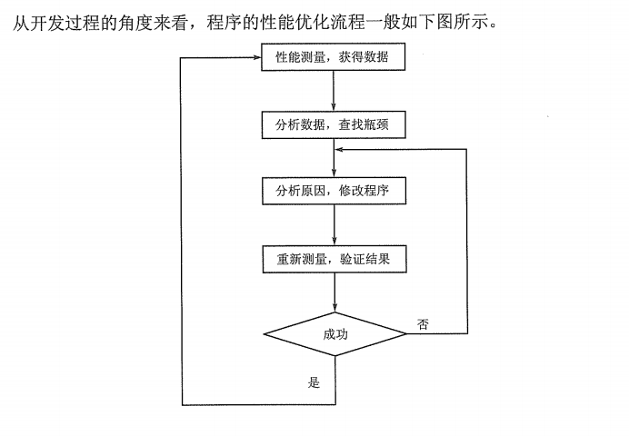

冯宏华, 徐莹, & 程远. (2007). C++ 应用程序性能优化.
+ 程序性能优化的过程

性能优化的第1步是测量，尤其是规模较大，并且比较复杂的软件系统，测量性能数据是进行性能优化的基础。
性能优化应该是针对系统的性能瓶颈进行的。
进行性能分析的核心在于第3步，即分析原因，修改程序。
程序的性能包括很多方面，常见的有程序的启动速度，运行速度及运行时占用的内存等。
+ 一个程序占用的内存区一般分为如下五种：全局/静态数据区、常量数据区、代码区、栈、堆。(p4)
栈中存储自动变量或者局部变量，以及传递的函数参数等，而堆是用户程序控制的存储区，存储动态产生的数据。
+ 通过new或者malloc获得的内存是堆的内存。
+ 内存对齐方式(p6)
+ 当开发人员在一个函数内部定义了一个变量，或者向某个函数传递参数时，这些变量或者参数存储在栈中。当退出这些栈的作用域时，这些栈上的存储单元会被自动释放。当开发人员通过malloc来申请一块内存或者通过new来创建一个对象时，申请的内存或对象所占的内存在堆上分配。开发人员需要记录得到的地址，并且在不需要时释放这些内存。(p9)
+ 内存泄露
栈上的内存不存在泄露的问题，而堆上的内存容易引起内存泄露。但很多应用需要动态地管理数据，就无法使用栈。另外，栈的大小有限制，占用内存较多的对象或数据只能分配在堆上。(p9)
+ 栈 内存系统自动分配 效率较高 分配的内存空间连续 不会产生内存碎片
堆 与此相对
+ 如果一个对象通过定义在某个函数内的变量或者实现需要的临时变量来创建时，它是栈上的一个对象；如果一个对象是定义在全局范围内的变量，则它存储在全局/静态数据区；如果一个对象是通过new操作符来来创建时，它是堆上的一个对象。(11)
+ 通过实现创建对象（的生命周期）：这种情况一般是指一些隐藏的中间临时变量的创建和销毁。它们的生命周期很短，也不易被开发人员察觉，但常常是造成程序性能下降的瓶颈，尤其是对于那些占用内存较多，创建速度较慢的对象。
这些临时对象一般是拷贝构造函数创建的。(p15)
+ 非静态数据成员是影响对象占据内存大小的主要因素，随着对象数目的增加，非静态数据成员占据的内存会相应增加。
所有的对象共享一份静态数据成员，所以静态数据成员占据的内存的数量不会随着对象数目的增加而增加。
静态成员函数和非静态成员函数不会影响对象内存的大小，虽然其实现会占据相应的内存空间，同样也不会随着对象数目的增加而增加。
如果对象中包含虚函数，会增加4个字节的空间，不论有多少个虚函数。(p19)
+ 有一些操作易成为程序的瓶颈：
1）缺页：缺页往往意味着需要访问外部存储
2）从堆中动态申请和释放内存：应当优先考虑栈而减少从动态堆中申请内存
3）复杂对象的创建和销毁：往往是一个层次相当深的递归调用
4）函数调用：函数调用有固定的额外开销，提倡使用内联函数(p38)
+ 构造函数和析构函数的特点是当创建对象时，自动执行构造函数；当销毁对象时，析构函数自动被执行。这两个函数分别是一个对象最先或最后被执行的函数，构造函数在创建对象时调用，用来初始化该对象的初始状态和取得该对象被使用前需要的一些资源，比如文件/网络连接等；析构函数执行与构造函数相反的操作，主要是释放对象拥有的资源，而且在此对象的生命周期这两个函数都只被执行一次。(p39)
+ 创建一个对象一般有两种方式，一种是从线程运行栈中创建，也称为“局部对象”，一般语句为:
````c
{
  ......
  Object obj;
  ......
}
````
销毁这种对象并不需要程序显式地调用析构函数，而是当程序运行出该对象所属的作用域时自动调用。在这种方式中，对象obj的内存在程序进入该作用域时，编译器生成的代码已经为其分配（一般都是通过移动栈指针——。最后通过一个退栈语句一次性将空间返回给线程栈。
另一种创建对象的方式为从全局堆中动态创建，一般语句为：
````c
{
  ......
  Object* obj = new Object;   (1)
  ......
  delete obj;                 (2)
  ......
}                             (3)
````
当执行(1)句时，指针obj所指向对象的内存从全局堆中取得，并将地址赋给obj。但指针obj本身却是 一个局部对象，需要从线程栈中分配，它所指向的对象从全局堆中分配内存存放。从全局堆中创建的对象需要显式调用delete销毁，delete会调用该指针指向的对象的析构函数，并将该对象所占的全局堆内存空间返回给全局堆，如(2)句。执行完(2)句后，指针obj所指向的对象确实已被销毁，但是指针obj却还存在于栈中，直到程序退出其所在的作用域，即执行到(3)处时，指针obj才会消失。需要注意的是，指针obj的值在(2)处至(3)处之间，仍然指向刚才被销毁的对象的位置，这时使用这个指针是危险的。(p40)
+ 创建一个对象分为两个步骤，即首先取得对象所需的内存(无论是从线程栈还是内存堆中)，然后在该块内存上执行构造函数。在构造函数构造该对象时，构造函数也分为两个步骤。即第1步执行初始化(通过初始化列表)，第2步执行构造函数的函数体。(p40)
+ 对初始化操作，构造函数其实是一个递归操作，在每层递归内部的操作遵循严格的次序。(p41)
+ 在c++程序中，创建/销毁对象是影响性能的一个非常突出的操作。首先，如果是从全局堆中生成对象，则需要首先进行动态内存分配操作。众所周知，动态内存分配/回收在c/c++程序中一直是非常费时的。因为牵扯到寻找匹配大小的内存块，找到后可能还需要截断处理，然后还需要修改维护全局堆内存使用情况信息的链表等。因为意识到频繁的内存操作会严重影响性能的下降，所以已经发展出很多技术用来缓解和降低这种影响，比如内存池技术。当取得内存后，如果需要生成的目标对象属于一个复杂继承体系中末端的类，那么该构造函数的调用就会引发一长串的递归构造操作。在大型复杂系统中，大量此类对象的创建很快就会成为消耗CPU操作的主要部分。在尽量减少自己所写代码生成的对象的同时，开发人员也开始留意编译器在编译时“悄悄”生成的一些临时对象。开发人员有责任尽量避免编译器为其程序生成临时对象。(p46)
+ 减少对象创建/销毁的一个很简单且常见的方法就是在函数声明中将所有的值传递改为常量引用传递，比如下面的函数声明
`int foo(Object a)`
应该相应改为
`int foo(const Object& a)`
(p46)
+ 当函数需要修改传入参数时，如果函数声明中传入参数为对象，那么这种设计达不到预期目的，即是错误的，这时应该用应用传入参数。当函数不会修改传入参数时，如果函数声明中传入参数为对象，则这种设计能够达到程序的目的，但是因为会生成不必要的复制品对象，从而引入了不必要的构造/析构操作。这种设计是不必要和低效的，应该用常量引入传入参数。(p48)
+ 产生临时对象一般来说有如下两种场合：
1）当实际调用函数时传入的参数与函数定义中声明的变量类型不匹配
2）当函数返回一个对象时（有例外)(p64)
+ 使用operator+=不产生临时对象，性能会比operator+要好，为此尽量使用语句
`a += b;`
而避免使用
`a = a+b;`
对于非内建类型，在保证程序语义正确的前提下应该多用
` ++i;`
而避免使用
`i++;`
(后置++在实现中必须首先保留其原来的值，为此需要一个局部变量。然后值增1后，将保留其原值的局部变量作为返回值返回。相比较而言，前置++的实现不会需要这样一个局部变量)(p75)
+ 在C++语言的设计中，内联函数的引入可以说完全是为了性能的考虑。因此在编写对性能要求比较高的C++程序时，非常有必要仔细考量内联函数的使用。
所谓“内联”，即将被调用函数的函数体代码直接地整个插入到该函数被调用处，而不是通过call语句进行。(p77)
+ 本质上虚拟内存就是要让一个程序的代码和数据在没有全部载入内存时即可运行。运行过程中，当执行到尚未载入内存的代码，或者要访问还没有载入内存的数据时，虚拟内存管理器动态地将这部分代码或数据从硬盘载入到内存中。而且在通常情况下，虚拟内存管理器也会相应地先将内存中某些代码或数据置换到硬盘中，为即将载入的代码或数据腾出空间。
因为内存和硬盘之间的数据传输相对代码执行来说，是非常慢的操作，因此虚拟内存管理器在保证工作正确的前提下，还必须考虑效率因素。比如，它需要优化置换算法，尽量避免就要执行的代码或访问的数据刚被置换出内存，而很久没有访问的代码或数据却一直驻留在内存中。另外，它还需要将驻留在内存的各个进程的代码或数据维系在一个合理的数量上，并且根据该进程的性能表现动态调整此数量，等等，使得程序运行时将涉及的磁盘I/O次数降到尽可能低，以提高程序的运行性能。(p120)
+ 
