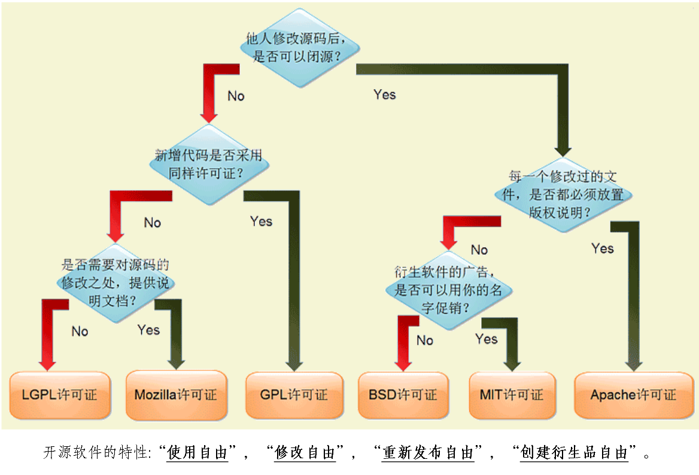
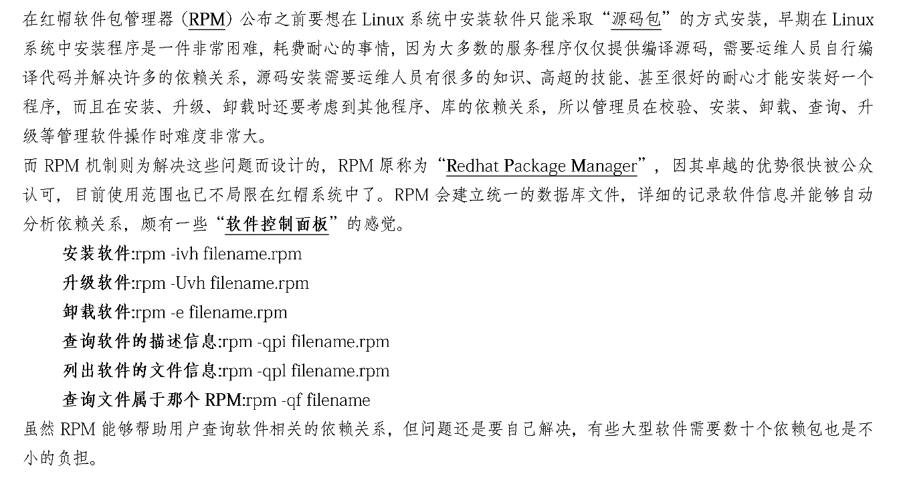

linux就该这么学
+
 
+ VNV(Virtual network computing)
+ RPM

+
  /关键词 &nbsp;  从上至下搜索某个关键词
?关键词 &nbsp; 从下至上搜索某个关键词
n      &nbsp;     定位到下一个搜索到的关键词
N         &nbsp;  定位到上一个搜索到的关键词
+ echo命令用于在终端显示字符串或变量，格式为：“echo [字符串|变量]”
e.g.用echo命令查看SHELL变量的值：echo $SHELL
+ wget命令用于命令行下载网络文件，格式为：“wget [参数] 下载地址”
-b         &nbsp; 后台下载模式
-O      &nbsp;    下载到指定目录
-t        &nbsp;  最大尝试次数
-c         &nbsp; 断点续传
-p       &nbsp;   下载页面内所有资源，包括图片、视频等
-r        &nbsp;  递归下载
+ elinks用于实现一个纯文本界面的浏览器，格式为：“elinks [参数] 网址”
+ uname命令用于查看系统内核版本等信息，格式为：“uname [-a]”
查看系统的内核名称、内核发行版、内核版本、节点名、硬件名称、硬件平台、处理器类型、操作系统等信息
+ uptime命令用于查看系统的负载情况，格式为：“uptime”
也可用“watch -n 1 uptime”来刷新每一次获得当前的系统负载情况，输出内容分别为系统当前时间、系统已运行时间、当前在线用户以及平均负载值。平均负载分别为最近1分钟、5分钟、15分钟的系统负载情况，负载值越小越好（小于1是正常）。
+ free命令用于显示当前系统中内存的使用量情况，格式为：“free [-m/-g]”
(以m为单位/以g为单位)
+ last命令用于查看所有系统的登入记录，格式为：“last [参数]”
+ cat用于查看纯文本文件（较短的），格式为：“cat [选项] [文件]”
-n   &nbsp;    显示行号
-b    &nbsp;   显示行号（不包括空行）
-A  &nbsp;     显示出“不可见”的符合，如空格，tab键等等
+ more用于查看纯文本文件（较长的），格式为：“more [选项] [文件]”
-数字 &nbsp;   预先显示的行数（默认为一页）
-d    &nbsp;   显示提示语句与报错信息
+ head用于查看纯文本文件的前N行，格式为：“haed [选项] [文件]”
e.g.
-n 10   &nbsp;     显示10行
-n -10  &nbsp;     正常输出，但不显示最后的10行
+ tail用于查看纯文本文件的后N行，格式为：“tail [选项] [文件]”
-n       &nbsp;    显示后面的10行
-f     &nbsp;      持续刷新显示的内容
+ od命令用于查看特殊格式的文件，格式为：“od [选项] [文件]”
-t a     &nbsp;    默认字符
-t c     &nbsp;    ASCII字符
-t o     &nbsp;    八进制
-t d    &nbsp;     十进制
-t x     &nbsp;    十六进制
-t f     &nbsp;    浮点数
+ tr命令用于转换文本文件中的字符，格式为：“tr [原始字符] [目标字符]”
e.g. 将tr.txt文件的内容转换为大写
````shell
cat tr.txt| tr [a-z] [A-Z]
````
+ wc命令用于统计指定文本的行数、字数、字节数，格式为“wc [参数] 文本”
-l   &nbsp;        只显示行数
-w     &nbsp;      只显示单词数
-c   &nbsp;        只显示字节数
e.g.统计当前系统中的用户个数
````shell
wc -l /etc/passwd
````
+ diff命令用于比较多个文本文件的差异，格式为：“diff [参数] 文件”
-b   &nbsp;        忽略空格引起的差异
-B    &nbsp;       忽略空行引起的差异
--brief或-q  &nbsp; 仅报告是否存在差异
-c    &nbsp;       使用上下文输出格式
e.g.
````shell
diff diff_a.txt diff_b.txt
````
+ touch命令用于创建空白文件与修改文件时间，格式为：“touch [选项] [文件]”
-a  &nbsp;       仅修改“访问时间”(atime)
-m     &nbsp;    仅修改“更改时间”(mtime)
-d    &nbsp;     同时修改atime与mtime
-t   &nbsp;      要修改成的时间[YYMMDDhhmm]
e.g.如果黑客执行了touch -d "2 days ago" test, 便将访问与修改时间修改为了2天前（伪造了自己没有动过该文件的假象）
+ 变量!$代表上一条命令的参数
+ mkdir [选项] 目录
-m=MODE  &nbsp;  默认的文件目录权限，如“—m 755”
-p  &nbsp;       连续创建多层目录
-v     &nbsp;    显示创建的过程
+ cp命令用于复制文件或目录，格式为："cp [选项] 源文件 目标文件"
+ rm [选项] 文件
-f     &nbsp;    忽略警告信息
-i     &nbsp;    删除前先询问
-r      &nbsp;   删除文件夹
+ dd命令用于指定大小的拷贝的文件或指定转换文件，格式为：“dd [参数]”
if    &nbsp;     输入的文件名称
of    &nbsp;     输出的文件名称
bs      &nbsp;   设置每个“块”的大小
count   &nbsp;   设置要拷贝的“块”的个数
conv=ucase  &nbsp;   将字母从小写转换为大写
conv=lcase  &nbsp;   把字符vpmg大写转换为小写
e.g.将光驱设备拷贝成镜像文件
````shell
dd if=/dev/cdrom of=RHEL-server-7.0-x86-Linux.iso
````
+ useradd命令用于创建新的用户，格式为：“useradd [选项] 用户名”
-d     &nbsp;    指定用户的家目录（默认为/home/username)
-D      &nbsp;   展示默认值
-e      &nbsp; &nbsp;   账号有效截止日期，格式：YYYY-MM-DD
-g     &nbsp;    指定一个初始用户组（必须已存在）
-s    &nbsp;     指定默认的shell
-u   &nbsp;      指定应该的 UID
+ passwd [选项] [用户名]
-l   &nbsp;      锁定用户禁止其登录
-u   &nbsp;      解除锁定，允许用户登录
--stdin  &nbsp;  允许从标准输入修改用户密码，如(echo "NewPassWord"|passwd --stdin Username)
-d     &nbsp;    使账号无密码
-e     &nbsp;    强制用户下次登陆时修改密码
-S      &nbsp;   显示用户的密码状态
+ usermod命令用于修改用户的属性，格式为：usermod [选项] 用户名
-c     &nbsp;    填写账号的备注信息
-d -m   &nbsp;   -m与-d连用，可重新指定用户的家目录并将旧的数据转移过去
-e      &nbsp;   账号到期时间，格式：YYYY-MM-DD
-g       &nbsp;  变更所属用户组
-L       &nbsp;  锁定用户禁止其登陆系统
-U       &nbsp;  解锁用户，允许其登陆系统
+ tar [选项] [文件]
-c     &nbsp;    创建压缩文件
-x &nbsp; 解开压缩文件
-t &nbsp; 查看压缩包内有哪些文件
-z &nbsp; 用Gzip压缩或解压
-j &nbsp; 用bzip压缩或解压
-v &nbsp; 显示压缩或解压过程
-f &nbsp; 目标文件名
-C &nbsp; 指定解压到的文件
e.g. 将/etc目录内文件打包并通过gzip格式压缩
````shell
tar czvf etc.tar.gz /etc
````
    将etc.tar.gz解压到/root/etc目录中
````shell
tar xzvf etc.tar.gz -C /root/etc
````
+ grep命令用于对文本进行搜索，格式为：“grep [选项] [文件]”
-b &nbsp; 将可执行文件(binary)当作文本文件(text)来搜索
-c &nbsp; 仅显示找到的次数
-i &nbsp; 忽略大小写
-n &nbsp; 显示行号
+ find用于查找文件，格式为：“fing [查找路径] 寻找条件 操作”
+ 管道命令符的作用是将前一个命令的标准输出当作后一个命令的标准输入，格式为“命令A|命令B”
+ 对于输出重定向符
命令 > 文件 &nbsp; 将标准输出重定向到一个文件中（清空原有文件的数据）
命令 >> 文件 &nbsp; 将标准输出重定向到一个文件中（追加到原有内容后面）
+ 对于输入重定向
命令 < 文件&nbsp; 将文件作为命令的标准输入
命令 << 分界符 &nbsp; 从标准输入中读入，直到遇见“分界符”才停止
命令 < 文件1 > 文件2 &nbsp; 将文件1作为命令的标准输入并将标准输出到文件2
e.g.将man命令的帮助文档写入到/root/mam.txt中
````
man bash> /root/man.txt
````
    向readme.txt中写入一行文字：
````
echo "Welcome" >read.txt
````
    向read.txt中追加一行文字
````
echo "Welcome">>read.txt
````
    把readme.txt文件作为输入重定向给wc -l命令来计算行数，命令等同于“cat readme.txt|wc -l”
````
wc -l< readme.txt
````
+ 通配符
[0-9] &nbsp; 匹配范围内的数字
[abc] &nbsp; 匹配已知的任意字符
+ 一个完整的shell脚本应该包括：脚本声明、注释信息和可执行语句
脚本声明（#!）:告知系统用何种shell来解释
注释信息（#）
可执行语句
shell脚本按照命令的执行顺序依次编写，每行写一条Linux命令
执行脚本有三种方法：
脚本文件文件路径：./Example.sh
sh脚本文件路径：sh Example.sh
source脚本文件路径：source Example.sh
+ shell预定义变量
\$0 &nbsp; 当前执行shell脚本的程序名
\$1-9,\${10},\${11}......   &nbsp; 参数的位置变量
\$#    &nbsp;  一共有多少个参数
\$*    &nbsp; 所有位置变量是值
\$?  &nbsp; 判断上一条命令是否执行成功，0为成功，非0为失败
+ scp命令用于在网络中安全传输文件，格式为：“scp [参数] 本地文件 远程账号@远程IP地址：远程目录”
-v  &nbsp; 显示详细的连接进度
-P  &nbsp; 指定远程主机的sshd端口号
-r  &nbsp; 传送文件夹加此参数
-6  &nbsp; 使用ipv6协议
+ [sed 删除文件中某行](http://blog.csdn.net/rgb_rgb/article/details/16887937) 
