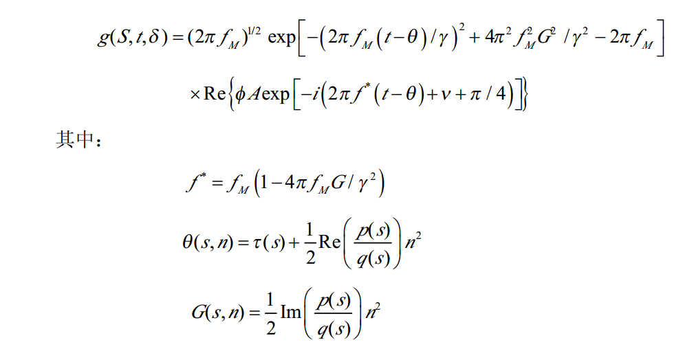

%高斯束正演.md

```
!!!!!!!!!!!!!!!!!!!!!!!!!!!!!!!!!!!!!!!!!!!!!!!!!!!!!!!!!!
	program Gaussian
	parameter(pi=3.1416,V0=2000.0,dx=50)
	dimension Alfa(0:1000),S(0:1000),u(-20:20,0:1000)
	dimension X(0:1000),Z(0:1000)
	complex::E=(0.0,-2.4E6),FY,P,Q,Ts
	FY=-(0.0,1.0)/4.0/pi*sqrt(E/V0)
	do j=-20,20
	do i=0,1000
	u(j,i)=0.0
	enddo
	enddo
	fm=40.0
	Gama=4.0

	do m=-500,500
	Alfa(0)=0.5*pi/500.0*m+pi
	call ray(X,Z,S,Alfa,XX,SS,TT,Alfaa,P,Q)
	do mm=-20,20
	if(SS>0.0)then
	if(mm*dx-XX<316.0.and.mm*dx-XX>-316.0)then
	Ts=TT+(mm*dx-XX)*cos(Alfaa-0.5*pi)/V0+&
	0.5*P/Q*((mm*dx-XX)*sin(Alfaa-0.5*pi))**2
	dd=0.5*pi/500.0
	G=aimag(Ts)
	Sita=real(Ts)
	Qd=V0*abs(1000/cos(Alfa(0)))
	do i=0,1000
	t=1.0/1000*i
	ff=fm*(1-4.0*pi*fm*G/Gama**2)
	u(mm,i)=u(mm,i)+sqrt(2*pi*fm)*(FY/sqrt(Q*Qd))*&
	    exp(-(2*pi*fm*(t-Sita)/Gama)**2+(2*pi*fm*G/Gama)**2-2*pi*fm*G)&
	    *exp(-((0.0,1.0))*(2*pi*ff*(t-Sita)+0.25*pi))*dd
	enddo
	endif
	endif
	enddo
	enddo

```
E--------------参数$\varepsilon$，
Fy------------参数$\Phi$
A-------------波束幅值
V0-----------介质波速
r--------------震源与接收点间距
fm-----------子波主频
Gama-------子波参数$\gamma$, the quantity $\gamma$ controls the width of the Gaussian envelope, with the respect to the pravailing frequency $f_M$
deta------------射线与z轴夹角
xs------------坐标s
xn------------坐标n
dd------------射线入射角采样间隔
Sita----------即$\theta(s,n)$
G------------即G(s,n)
ff------------即$f^*$，the prevailing frequency of the Gaussian packet
t-------------时间
